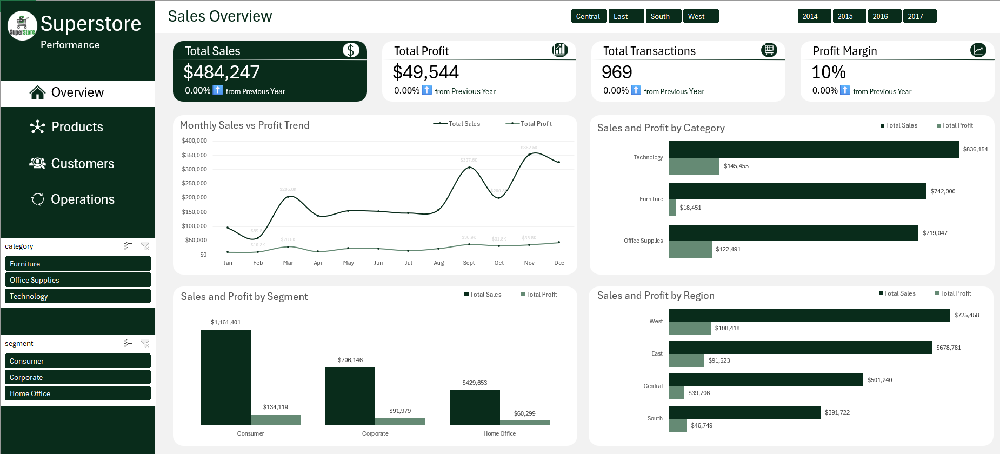
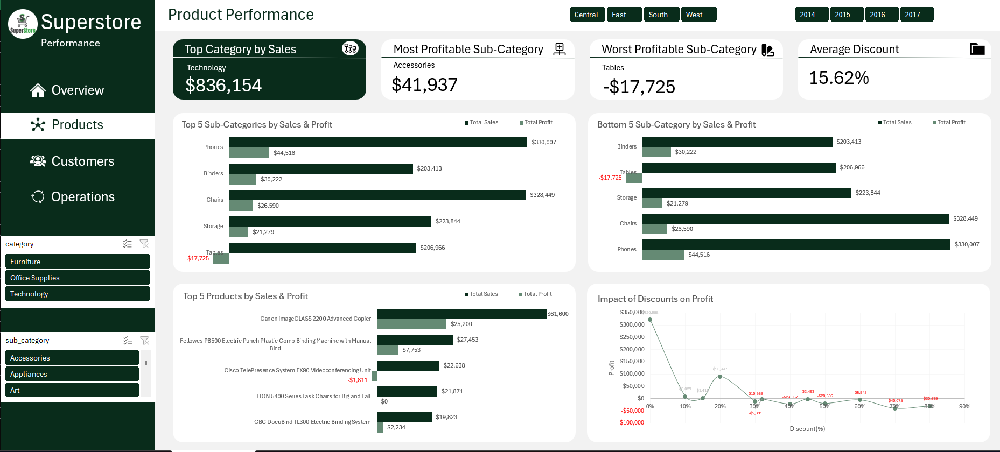
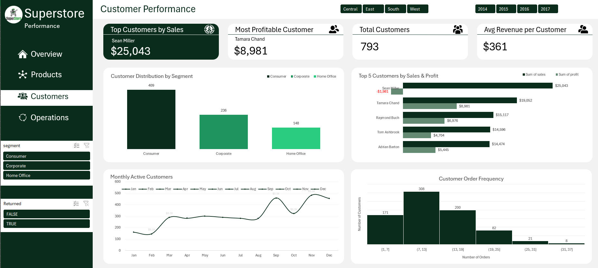
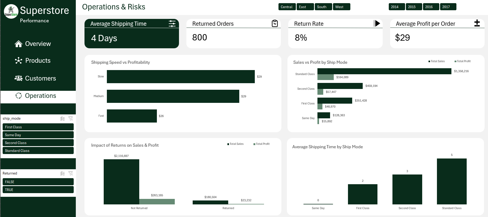

# Superstore Performance & Operations Dashboard

An interactive, multi-page Excel dashboard system designed to analyze operational efficiency, profitability drivers, customer behavior, and product performance for a retail organization.

## 1. Project Overview

- **Project Title:**  Superstore Executive Performance & Operations Dashboard  
- **Project Description:**  Developed an enterprise Excel dashboard system leveraging an underlying Pivot Engine to track sales revenue, profit margins, operational risks (returns and shipping delays), customer segments, and product lines.  
- **Project Type:**  Interactive Excel Dashboard & Analytical Model  
- **Business Scenario:**  Superstore leadership required clear visibility into regional and segment profitability, return rates, customer order frequencies, and product performance to mitigate loss-making products and streamline operations.  
- **Tools & Methods:**  Microsoft Excel (PivotTables, PivotCharts, Slicers, Data Modeling, Advanced Formulas: `DATEDIF`, `XLOOKUP`, `SUMIFS`), Data Visualization  

## 2. Business Problem & Project Objectives

### Business Problem

Superstore experienced operational bottlenecks that includes high product return volumes and varied shipping delays—alongside negative margins across specific sub-categories (e.g., Tables) and discounting strategies. Executive leadership lacked an integrated, single-source-of-truth tool to diagnose margin leakage and evaluate customer lifetime value.

### Project Objective

Build a dynamic, decision-ready Excel framework that aggregates operational and sales metrics into four core reporting views, enabling executives to identify profit drivers, optimize fulfillment options, and minimize return risks.

### Primary Business Questions

1. **Sales & Profitability:** Which regions, customer segments, and product categories generate the highest profit margins?

2. **Product Performance:** Which sub-categories and products drive profit loss, and how do discount levels impact bottom-line profitability?

3. **Customer Value:** What is the order frequency distribution across the customer base, and who are the top revenue- and profit-contributing customers?

4. **Operations & Risk:** What are the average fulfillment times across shipping modes, and what is the financial impact of product returns?

### Project Scope

* **In-Scope:** Data cleaning, table relationships, pivot engines, 4 specialized dashboard pages (Sales Overview, Product Performance, Customer Performance, Operations & Risk), interactive slicers (Region, Year, Category, Ship Mode, Returned).

* **Out-of-Scope:** Direct database write-backs, real-time API integrations, and predictive machine learning models.

## 3. Dataset

- **Data Source:**  Superstore Operational Dataset (`Superstore_Dataset.xlsx`)  
- **Data Coverage:**  4-Year Historical Data (2014 – 2017) across 4 US Regions (Central, East, South, West)  
- **Data Structure:**  3 Worksheets: `orders` (9,994 line items), `returns` (296 records), `people` (4 region supervisors)  
- **Key Fields:**  `order_id`, `order_date`, `ship_date`, `ship_mode`, `customer_id`, `segment`, `region`, `category`, `sub_category`, `sales`, `discount`, `profit`  
- **Data Limitations:**  Contains nested order line items requiring aggregation at the order/customer level; transactional data limited to US operations.  

## 4. Data Preparation

1. **Data Cleaning & Standardization:** Cleaned text formatting across customer names, categories, and geographic fields; corrected space inconsistencies in worksheet tab naming.

2. **Data Model Enrichment:** Joined the `returns` dataset with `orders` via `order_id` to add a boolean `Returned` field. Joined `people` to assign `Supervisor` mapping per region.

3. **Fulfillment & Shipping Calculations:** Calculated `Shipping_Time (Days)` using `ship_date - order_date`. Applied conditional logic to bucket fulfillment speeds (`Fast`, `Medium`, `Slow`).

4. **Time Intelligence Expressions:** Extracted `Order_Year`, `Order_Month`, and `Ship_Month` from timestamp fields to support year-over-year (YoY) dynamic slicer filtering and seasonality trends.

5. **Quality Assurance:** Reconciled revenue, profit, and order count metrics against raw transaction logs to ensure 100% data integrity.

## 5. Analysis & Technical Development

* **Pivot Engine Architecture:** Created a hidden `Pivot_Engine` tab housing distinct PivotTables that feed visual components dynamically without overloading sheet performance.

* **Sales & Margin Analysis:** Calculated profit margins by Region, Category, and Segment using dynamic custom calculated fields.

* **Discount Impact Analysis:** Evaluated profit trajectory across incremental discount brackets (0% to 80%) to highlight profitability thresholds.

* **Operational Risk Modeling:** Aggregated returned order volumes and associated revenue/profit losses across shipping modes and product lines.

## 6. Dashboard Structure & Features

### View the Interactive Dashboard

View the live dashboard [here](Superstore_data_Capstone_Project.xlsx)

### Dashboard Pages

1. **Sales Overview:** Key metrics including Total Sales, Total Profit, Total Transactions, and Profit Margin with YoY variance, alongside monthly trend lines and regional distributions.

2. **Product Performance:** Top & bottom sub-categories by sales/profit, top individual products, and a scatter/line visual mapping the negative correlation between discounts and profits.

3. **Customer Performance:** Metrics on total active customers, customer segmentation (Consumer, Corporate, Home Office), purchase frequency distribution, and top customer rankings.

4. **Operations & Risk:** Operational KPIs featuring Average Shipping Time, Returned Order Counts, Return Rate %, and shipping mode profitability breakdown.

### Key Features

* **Interactive Slicers:** Universal timeline/year filters (2014–2017), regional buttons (Central, East, South, West), Ship Mode, and Return Status toggles.

* **Custom Navigation Bar:** Left-side sidebar navigation menu supporting cross-page view jumps.

* **KPI Card Containers:** Modern visual containers presenting core headline numbers with dynamic micro-indicators.

## 7. Key Findings & Insights

* **Category Profitability Divergence:** **Technology** is the top revenue generator (\$836,154), whereas **Tables** represents the worst-performing sub-category, accounting for severe profit losses (-\$17,725).

* **Discounting Threshold Risk:** Profitability drops significantly when discount rates exceed **20%**, causing steep financial erosion across furniture and office supply lines.

* **Fulfillment Operations:** The overall **Average Shipping Time** is **4 Days**. Standard Class fulfillment takes an average of **5 Days**, whereas Same Day delivery achieves **0-day** turnaround.

* **Return Impact:** **800 orders** were returned (an overall **8% Return Rate**), resulting in over **\$100,000 in returned sales volume** and direct operational margin loss.

* **Customer Distribution:** The **Consumer Segment** represents the largest portion of the customer base (409 customers), while **Tamara Chand** stands out as the most profitable individual customer (\$8,981 profit).

## 8. Recommendations

1. **Eliminate / Redesign Loss-Making Sub-Categories:** Restructure pricing or supplier terms for **Tables** to restore profitability, or limit non-profitable SKUs.

2. **Implement Discount Caps:** Enforce strict discounting policies capping promotional discounts at **15–20%**, as deeper discounts directly impair profitability.

3. **Optimize Operational Return Workflows:** Investigate root causes for product returns in high-volume categories to lower the **8% Return Rate** and preserve margin.

4. **Targeted Customer Loyalty Programs:** Develop tailored retention campaigns for top-tier individual buyers and high-volume **Corporate / Consumer** segments to drive repeat orders.